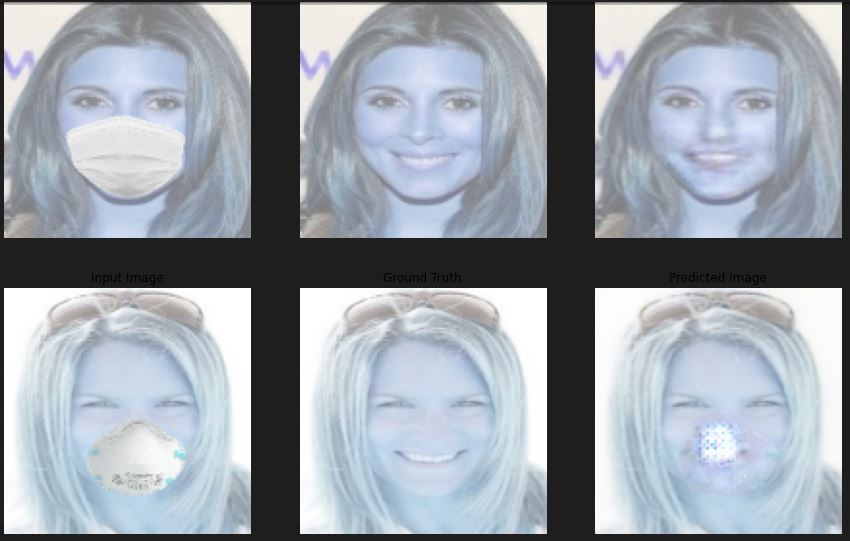
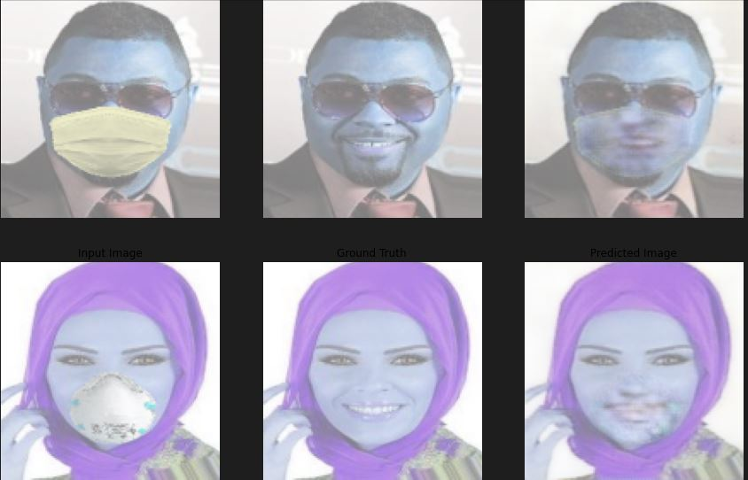

Face unmasking using GANs (Generative Adversarial Networks) is a task in which a GAN model is trained to generate images of faces with masks removed, given images of faces with masks on. This task can be useful in scenarios where people need to be identified or recognized, but masks are being worn due to safety concerns or other reasons.

GANs are deep learning models consisting of two neural networks, a generator and a discriminator. The generator takes random noise as input and generates fake images that mimic the distribution of the training data. The discriminator takes in both real and fake images and tries to distinguish between them. The two networks are trained together in an adversarial manner, where the generator aims to generate more realistic images to fool the discriminator, and the discriminator aims to correctly distinguish between real and fake images.

To create a face unmasking model using GANs, we can train the generator to take images of faces with masks on as input and output images of faces with masks removed. The discriminator is trained to distinguish between real images of unmasked faces and fake images generated by the generator.

Once the model is trained, we can use it to generate images of unmasked faces from images of faces with masks on. These generated images can be used to aid in identification or recognition tasks.

  
  

